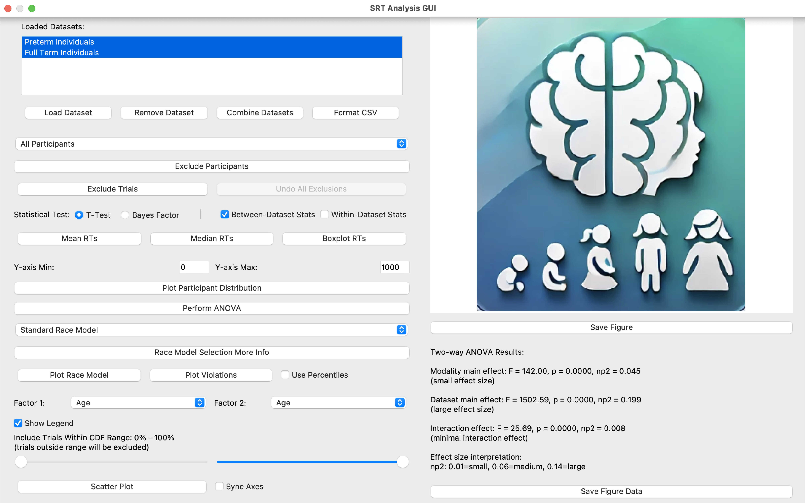
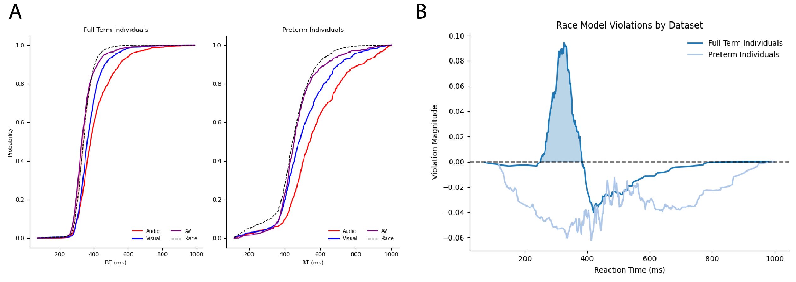
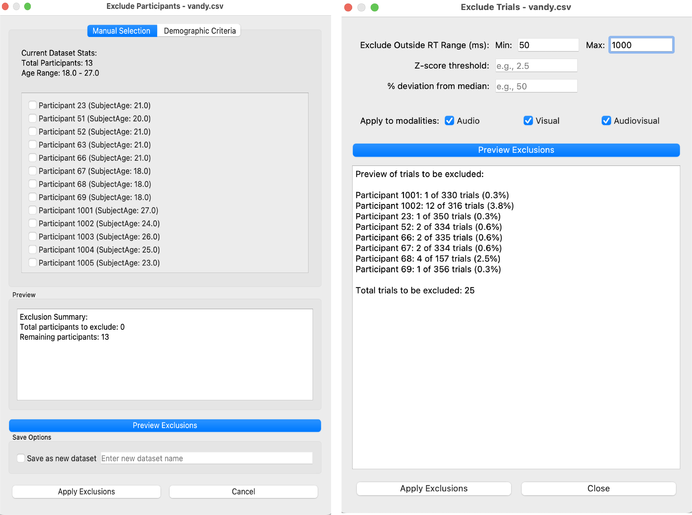

# CART-GUI
A comprehensive GUI tool for analyzing Simple Reaction Time (SRT) data with support for multiple datasets, statistical analyses, and visualization options.

## Table of Contents
- [Features](#features)
  - [Data Management](#data-management)
  - [Visualization Options](#visualization-options)
  - [Statistical Analysis](#statistical-analysis)
  - [Data Filtering](#data-filtering)
- [Installation](#installation)
  - [Using Conda (Recommended)](#using-conda-recommended)
  - [Manual Installation](#manual-installation)
- [Data Format Requirements](#data-format-requirements)
- [Usage Guide](#usage-guide)
  - [Basic Workflow](#basic-workflow)
  - [Advanced Features](#advanced-features)
    - [Race Model Analysis](#race-model-analysis)
    - [Statistical Analysis](#statistical-analysis)
    - [Data Exclusion and Filtering](#data-exclusion-and-filtering)
    - [Scatter Plot Analysis](#scatter-plot-analysis)
- [Contributing](#contributing)
- [License](#license)
- [Support](#support)

## Features

### Data Management
- **Load Multiple Datasets**: Manage and analyze multiple datasets simultaneously.
- **Supported Formats**: Import data from CSV and Excel files.
- **Dataset Combination**: Combine multiple datasets for comprehensive analysis.
- **Data Formatting**: Format raw data files to the required structure with ease.
- **Undo Modifications**: Track dataset modifications with undo capabilities.

### Visualization Options
- **Mean and Median Reaction Times**: Visualize mean and median reaction times across modalities and datasets.
- **Boxplot Distributions**: Compare distributions using boxplots.
- **Participant Distributions**: Analyze individual participant distributions.
- **Race Model Analysis**: Visualize race model predictions and violations.
- **Scatter Plot Analysis**: Explore relationships between various factors using scatter plots.

### Statistical Analysis
- **T-tests and Bayesian Analysis**: Perform statistical tests within and between datasets.
- **ANOVA Analysis**: Conduct ANOVA for more complex comparisons.
- **Race Model Violation Statistics**: Analyze race model violations statistically.
- **Correlation Analysis**: Examine relationships between variables.

### Data Filtering
- **Participant Exclusion Tools**: Exclude specific participants based on criteria.
- **Trial-level Filtering**: Filter out trials based on reaction time ranges, z-scores, or deviation from median.
- **Demographic-based Filtering**: Filter data based on demographic variables.
- **Percentile-based Analysis Ranges**: Focus on specific percentile ranges of the data.

## Installation

### Using Conda (Recommended)
1. Clone the repository
2. Create conda environment
3. Run the application

### Manual Installation
1. Ensure Python 3.10+ is installed
2. Install required packages

## Data Format Requirements

### Required Columns
- `participant_number` (int): Unique identifier for each participant
- `modality` (int): Stimulus type
  - 1 = Audio
  - 2 = Visual
  - 3 = Audiovisual
- `reaction_time` (float): Response time in milliseconds

### Optional Demographics
- age or SubjectAge
- gender or SubjectSex
- Additional demographic columns will be auto-detected

### File Formats
- CSV (comma-separated values)
- Excel (.xlsx, .xls)
- First row must contain column headers

## Usage Guide

### Basic Workflow
1. Load Data:
   - Click "Load Dataset" button
   - Select CSV/Excel file
2. Configure dataset appearance
3. Data Preprocessing
4. Analysis Options
5. Export Results

### Advanced Features

#### Race Model Analysis
- Supports multiple model types
- Configurable parameters
- Comprehensive analysis options

#### Statistical Analysis
- Multiple test options
- Various comparison types
- Effect size metrics

#### Data Exclusion and Filtering
- Participant exclusion options
- Trial filtering capabilities
- Preview and undo options

#### Scatter Plot Analysis
- Multiple factor analysis
- Customization options
- Statistical integration

## Contributing
Please read our contributing guidelines for details on submitting pull requests.

## License
This project is licensed under the MIT License. See the LICENSE file for details.

## Support
- Issues: Submit through GitHub Issues
- Questions: Ask in Discussions
- Documentation: Visit our Wiki
